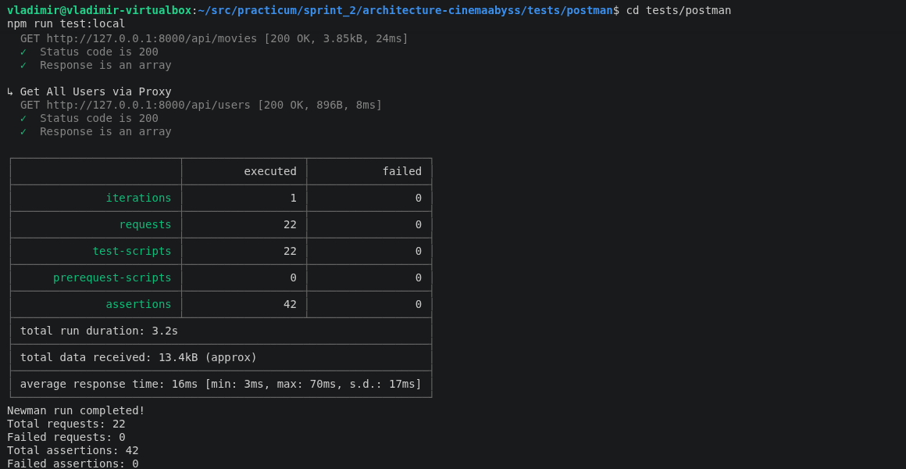
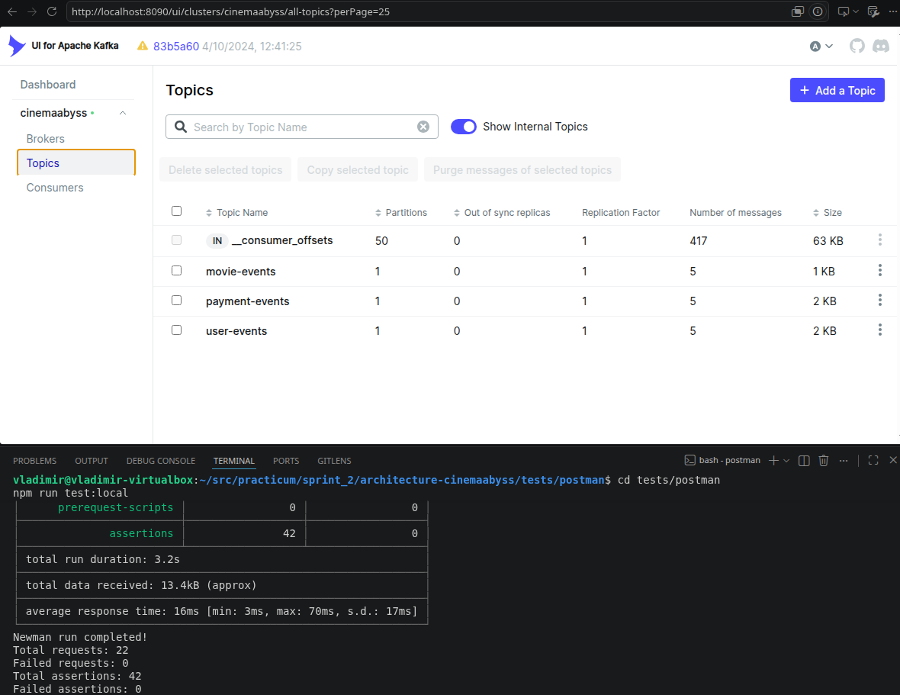
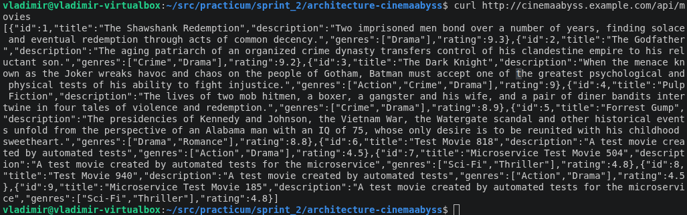
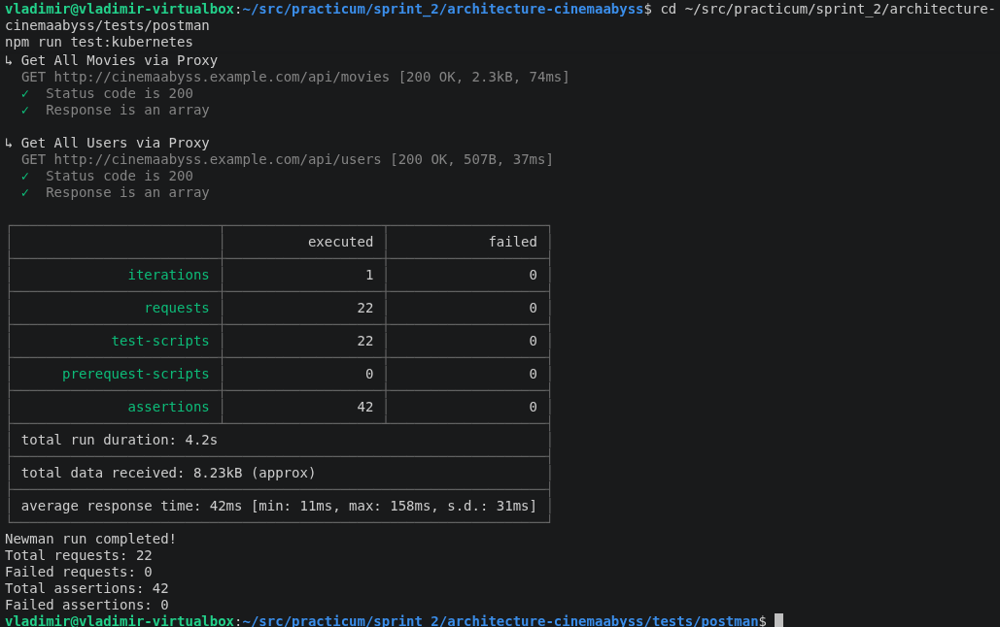
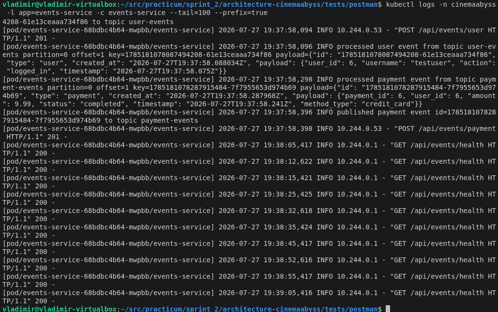
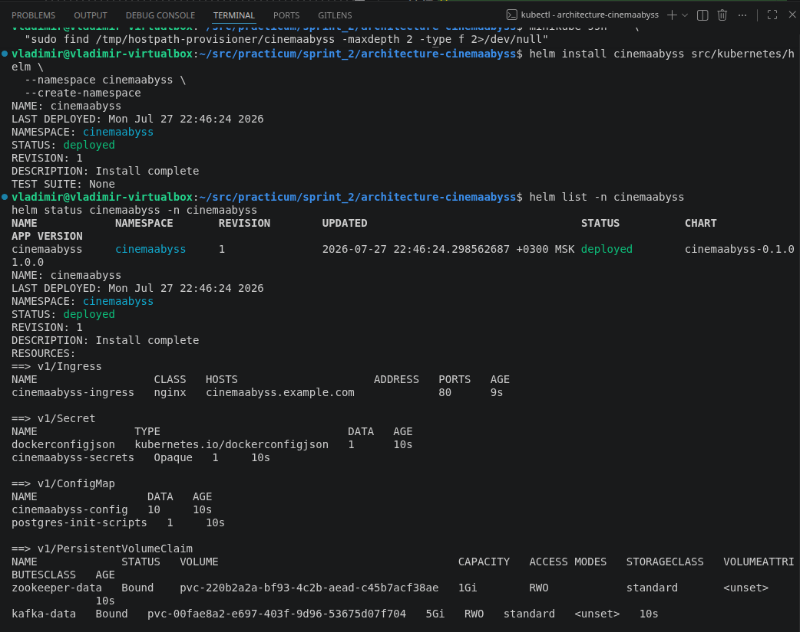
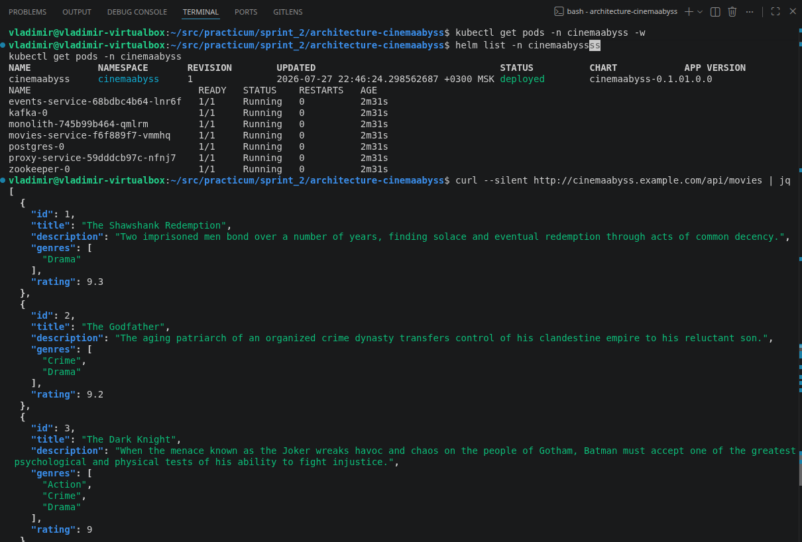

# Проектная работа 2 спринта. Кинобездна

## Задание 1. To-Be архитектура

Контейнерная C4-диаграмма: ![CinemaAbyss_ToBe_Containers](https://www.plantuml.com/plantuml/png/ZLPDRnDN5DtxLxnwPQikth2iAa980JKKGvAYhgA9ymWMzemrCqwngagsKo2L4IweLIL4WNRJxIJOySIEnt_Xt7_KtZiVdh5fwShFC-_TS--vvvutLnpNiDrMewxMQwPk66jxRSVPtRQkwjrrotIDcgbj9_T9pQpMM_jQVRv-kRn-UV7gYrnkS-tRsplRk_TkRj_OtToull7rjK8nbwjesx7CGhNbk5P3soMLnri4cD8pZ17W51xrCEB_UNxt1ouGK8ywyAcdw4VuilM2-YL5HvXJ1nvECQK1HjHJc2F047FurCK40SvBYhhKaqqS0G4zmGWpJE3dYt4sndwZPZBSAmIuW8SPXjHNU0KVCmGumGXZ336ZlcJr3Xx60dt2sM42hwIkwSFRJQUaxgoL50UX3YQSbCHudo_cSbjjnzMDtQjMozmtx7QXAio6k4j0yF95zNrEgOJHWj6iNJTS_PtH_kT4nROUjTMMjWzhLQtAQgroKqLlESDAstrWcILrTsDhMpB-5KE1y6YWg8U0ddBI2gVqM1ZpBYcymmWUfl0nfYEXSykr3VEWhctrPUr0mMT-HzJ121DCwJazXIVxf46UT6UY6jPXJJlI2dLV6sxBrkf-tJYub2zcwcbOfbMlkGzAAh-f3ungMzsAdd36rwryh0r9DC09TJ6b8vp1Pvai-hsY7OouxvXZ6ZqvWrzQreRFzN05h0zw5ic4EjIdnmmNLkhH4_WuNysTQoof_AsmsAWHgSHVI-izfXOp5Wv6AVbojYM5Ctx9a2Kbh9x7Qe6_ZAWFjUaoueOiqeXXitbrwvkAQjhMVgkgxNBLCfrMGzkAki9UNuAVgns7nwvYj1lQT4jAAbX2kxPNQ5gEUs1BZPLmkNLdCx_o3t-o6EY8VX9f2L2qV85V52ik5etFzFDa-7YVCBjSvvsMRkd2G-F-GvwBh_WtdrxWP-eoHVIOEWYOsL3Inw6wbsl5aAr1oMoTXftbmwo9z__UNO7VgSMuQkScGz_JUz4AlylaJ-avXc8cFaOAOuRlYN9yrYnNAXhZb49UP2yD-0rZ_f1OmiOZjs3hgjLeQ7FVS6kMwOG-Cn8Nkv2JmuKtncLtMSpoy0AUfFOICupe63CQh6nGqUYc0me1-M8waMOe3IUSFvaXUe6pICJYkJ9iEEVoMRvPv92E-Sh9T3BKpsBMhRPHTzkXvRDQJcLlNs6AW0PHpO4S5rOp3ZiFPvuFHAx1Wzp3Z5vG9vnsJccrzNm7vExgUke-ojWiNb8VO-edXhDM4GNSsDwkR9N5NOjoFhf15ih1suWc9cWGkMGY3ZyE4kEdKLF6YDTIoJ5rw4WaFORFQubN5zVy3CEueTHNBKVRJZdkODbfxJbLkzOKHSMOcRmpk96fiUj6ZPgBK6O85jP_AZRAbsdPQDRAuQbCRFLfnlW_09MusNyMAF73hSkvIyG5KIctmb-SMzYkihZzyH9RYI5pKFQnOXGjBFz_n6AwF-BksTXnlR6nuIqTiOEm6A9YmzieWSiu6GqI4sH_TwsgLOyY9ufBGhyHdPt8vybPSa5dfRSIQedF3tZHR_32potnsim5F9JFeCwIhfSwb3QLQ3HY7MLlwgJLF6lBOL8-yGOdaOybwL2NpNxHb8lmaoLGy33XWMVlZJoPFM4O-lGIOkwADlTRZVhV "CinemaAbyss_ToBe_Containers")


В целевой архитектуре у сервиса появляется единая точка входа - `proxy-service`. Он принимает клиентские REST-запросы и маршрутизирует их дальше:

- `users`, `payments`, `subscriptions` пока остаются в монолите;
- `movies` вынесен в отдельный микросервис и подключается через Strangler Fig;
- `events` вынесен в отдельный MVP-сервис, который пишет события в Kafka и сам же читает их consumer'ами;
- PostgreSQL остаётся общей БД на переходный период, чтобы миграция прошла без простоя;
- Kafka добавлена как база для дальнейшего асинхронного взаимодействия доменов.

Домены после разделения:

- профиль пользователя и авторизация;
- каталог и метаданные фильмов;
- подписки;
- платежи;
- события и интеграции;
- рекомендации как внешняя система.

Такой вариант позволяет двигаться постепенно: сначала вынести `movies`, потом убирать из монолита следующие домены, не меняя публичный API для клиентов.

## Задание 2. Proxy и Kafka

### 2.1 Proxy Service

Сервис реализован в [src/microservices/proxy](src/microservices/proxy).

Скриншот тестов: 

Скриншот Kafka топиков: 

Proxy Service написан на Python с использованием `requests` и стандартного HTTP-сервера. Он передаёт HTTP-запросы целевым сервисам и выбирает обработчик `/api/movies` согласно feature toggle.

Что делает proxy:

- отдаёт `/health`;
- проксирует `/api/users`, `/api/payments`, `/api/subscriptions` в монолит;
- проксирует `/api/events/*` в `events-service`;
- для `/api/movies` применяет Strangler Fig:
  - `GRADUAL_MIGRATION=false` - весь movie-трафик остаётся в монолите;
  - `GRADUAL_MIGRATION=true` и `MOVIES_MIGRATION_PERCENT=0` - весь movie-трафик остаётся в монолите;
  - `MOVIES_MIGRATION_PERCENT=100` - весь movie-трафик идёт в `movies-service`;

### 2.2 Events Service и Kafka

Сервис реализован в [src/microservices/events](src/microservices/events).

Events Service написан на Python с использованием `kafka-python`. Для каждого топика запускается отдельный consumer-поток, а общий producer публикует события, полученные через HTTP API.

API:

- `GET /api/events/health`;
- `POST /api/events/movie`;
- `POST /api/events/user`;
- `POST /api/events/payment`.

При каждом POST-запросе сервис:

- принимает JSON-событие;
- заворачивает его в envelope с `id`, `type`, `created_at`, `payload`;
- публикует сообщение в Kafka топик:
  - `movie-events`;
  - `user-events`;
  - `payment-events`;
- консьюмер внутри того же сервиса читает сообщения и пишет обработку в лог.


## Задание 3. CI/CD и Kubernetes

### 3.1 CI/CD

Workflow доработан в [.github/workflows/docker-build-push.yml](.github/workflows/docker-build-push.yml).

Пайплайн делает следующее:

- собирает Docker Compose стек;
- поднимает сервисы;
- ждёт готовности `monolith`, `movies-service`, `events-service`, `proxy-service`;
- собирает Docker-образ с Postman/Newman-тестами;
- запускает API-тесты в сети `cinemaabyss-network`;
- после успешных тестов собирает и публикует в GHCR образы:
  - `monolith`;
  - `movies-service`;
  - `events-service`;
  - `proxy-service`.

Workflow запускается на `main`, `master`, `cinema`, вручную и при публикации.

Образы публикуются в namespace репозитория:

```text
ghcr.io/joujoy77/architecture-cinemaabyss/monolith:latest
ghcr.io/joujoy77/architecture-cinemaabyss/movies-service:latest
ghcr.io/joujoy77/architecture-cinemaabyss/events-service:latest
ghcr.io/joujoy77/architecture-cinemaabyss/proxy-service:latest
```

### 3.2 Proxy и Events в Kubernetes

Доработаны манифесты:

- [src/kubernetes/proxy-service.yaml](src/kubernetes/proxy-service.yaml);
- [src/kubernetes/events-service.yaml](src/kubernetes/events-service.yaml);
- [src/kubernetes/ingress.yaml](src/kubernetes/ingress.yaml);
- [src/kubernetes/configmap.yaml](src/kubernetes/configmap.yaml).

В Kubernetes добавлены `Deployment` и `Service` для `proxy-service` и `events-service`.

Ingress настроен так:

- `/api/events` идёт напрямую в `events-service`;
- остальные запросы идут через `proxy-service`.

Для нормального старта в Minikube добавлены проверки зависимостей:

- `monolith` и `movies-service` стартуют после готовности PostgreSQL;
- `events-service` стартует после доступности Kafka и создания топиков;
- Kafka `Service` публикует NotReady эндпоинт, чтобы боркер во время запуска мог подключиться к собственному адресу, указанному в настройках Kafka.


Скриншот вызова curl: 

Скриншот вызова тестов кубера: 

Скриншот вывода event service: 

## Задание 4. Helm-чарты

Helm-чарт находится в [src/kubernetes/helm](src/kubernetes/helm).

Доработаны:

- [src/kubernetes/helm/values.yaml](src/kubernetes/helm/values.yaml);
- [src/kubernetes/helm/templates/services/proxy-service.yaml](src/kubernetes/helm/templates/services/proxy-service.yaml);
- [src/kubernetes/helm/templates/services/events-service.yaml](src/kubernetes/helm/templates/services/events-service.yaml);
- [src/kubernetes/helm/templates/configmap.yaml](src/kubernetes/helm/templates/configmap.yaml).

Proxy и Events теперь устанавливаются через Helm теми же настройками, что и обычные Kubernetes-манифесты:

- образ;
- replicas;
- resources;
- service port/targetPort;
- probes;
- env/configmap;
- imagePullSecrets.


Скриншот развертывания helm 

Скриншот вызовва curl: 

Вот так как-то :)
Прикольное задание, мне понравилось
